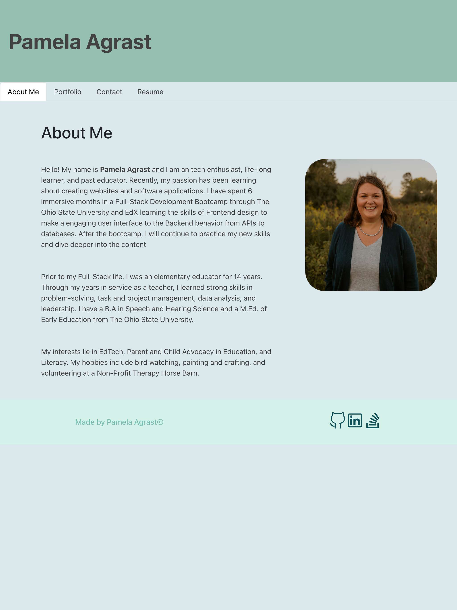

# Portfolio

## Description

   

  This my working Fullstack Developer Portfolio Website.  The website was built using React. It includes About Me, Portfolio, Contact, and Resume sections.  To stylize and mobilize the site, I used Bootstrap, which easily makes components mobile responsive.  

 Netify Website: https://pamela-agrast.netlify.app/#about

----------------------

  ## Table of Contents 
  
  - [Description](#description)
  - [Installation](#installation)
  - [Usage](#usage)
  - [Credits](#credits)
  - [License](#license)
  - [Questions](#questions)

---------------------- 

  ## Installation

  This website is not meant to be installed.

  In the resume section of this application, there is a button to download my resume.  Click the download button and it will download to your downloaded file on your computer.

----------------------

  ## Usage

  This is to be used as my Fullstack Developer Portfolio.  As I continue to make applications, I can add them to the portfolio section and a new card will be rendered.
  
----------------------

  ## Credits
  
  I relied on class material (Mini Project for Module 20) and worked with a tutor on some of the structure of this project.
  
----------------------

  ## License
  
  This project is licensed under the terms of the MIT license.  Click the badge at the top of the README to get more information about the license.
  
----------------------

  ## Questions

  Name: Pamela Agrast 
  Repository: https://github.com/agrastp/portfolio 
  E-mail: agrastp@yahoo.com
  
  
